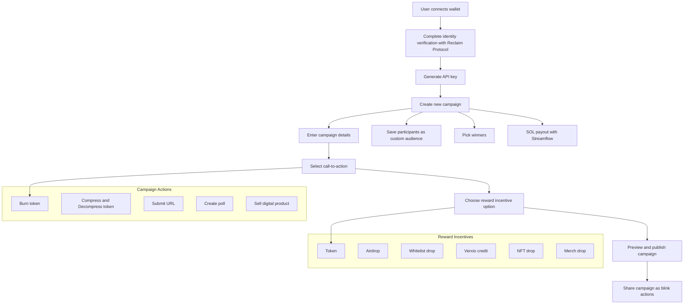

Ads creator for web3 developers and brands

<h3>
   
[API Docs](https://documenter.getpostman.com/view/22416364/2sA3kaCeiH) | [Website](https://www.verxio.xyz/) | [Demo Video](https://youtu.be/qNdvqlxM6b8)

</h3>

Projects share a common pain point; the difficulty connecting with the right users who would benefit from their product offerings.

Users on the other hand are bombarded with countless projects daily, making it nearly impossible to discover product offerings that truly align with their interests and needs.

Verxio makes ad creation easy, dynamic, interactive, and rewarding for users. Every campaign is a blink.

The most important part of any marketing campaign is the call-to-action. Verxio renders this as a blink, enabling users to interact directly with the project's offering from their environment.

Verxio increases the retention rate by 57% and creates a viral network effect for the project.

Projects can quickly integrate our SDK/API infrastructure into their existing application or use our no-code interface to experience verxio on the go.

During our private testing, over 126 blinks were created from campaigns by both web3 and web2 developers and brands with industries ranging from e-commerce to real estate, education, etc.

Verxio is not just changing how projects advertise but it is also reshaping how they grow, connect, and engage their community.

## 📖 Protocol Architecture

## 🛠 Workflow
1) First, the user creates a new profile by connecting their wallet.
They should complete their identity verification with Reclaim Protocol before they can participate in campaigns or create campaigns.
2) Then the user can now generate an API key for creating and managing campaigns
3) The user can create a new campaign, save participants as a custom audience, pick winners, and SOL payout for reward distribution with Streamflow.
4) Finally, the user can share their campaign call-to-action as blink actions.

## 🪛 Integration
[verxio-protocol](https://documenter.getpostman.com/view/22416364/2sA3kaCeiH) – API endpoints for easy interaction with the Verxio Protocol, it can easily be expanded by adding new implementations.
The entire Verxio web application is written using these endpoints.

[streamflow-stream](https://docs.streamflow.finance/en/articles/9675301-javascript-sdk) - Interact with the protocol to create streams and vesting contracts. Token reward payout to the winner is initiated with Streamflow.

[reclaim-protocol](https://www.reclaimprotocol.org/) - used for ZkProof identification to prevent spam, and bots and ensure real human interactions.

[light-protocol](https://lightprotocol.com/) - Used the compression APIs to create several ad campaign templates.

## 🌐 Repo URLs
- [Verxio Backend Endpoints](https://github.com/Axio-Lab/verxioprotocol/tree/main/Verxio)
- [Verxio Actions](https://github.com/Axio-Lab/verxioprotocol/tree/main/VerxioActions)

